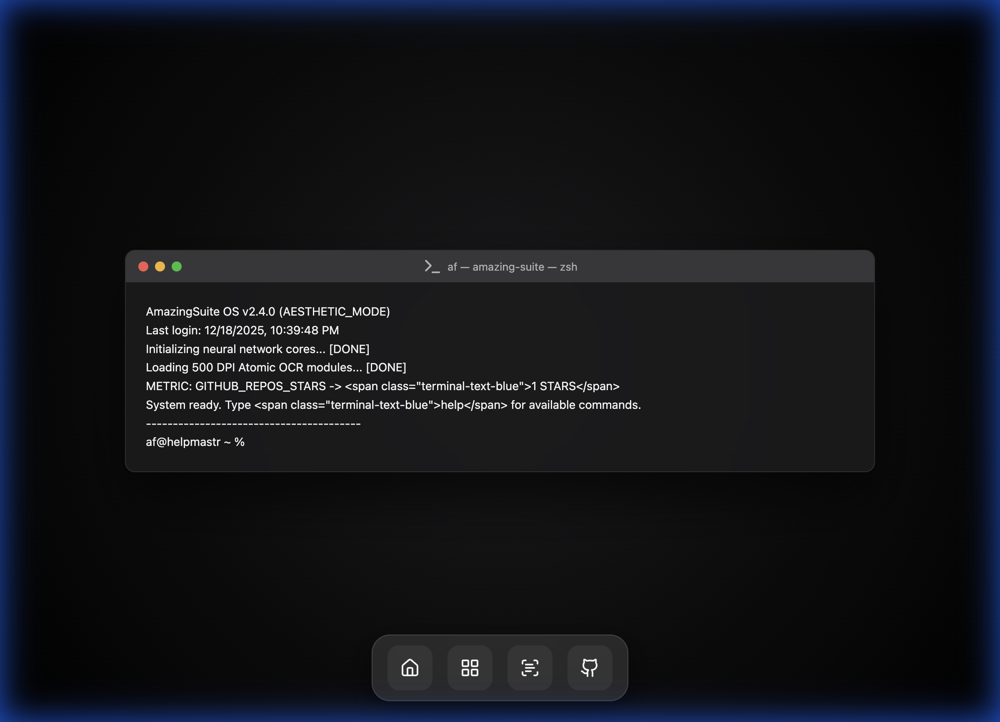
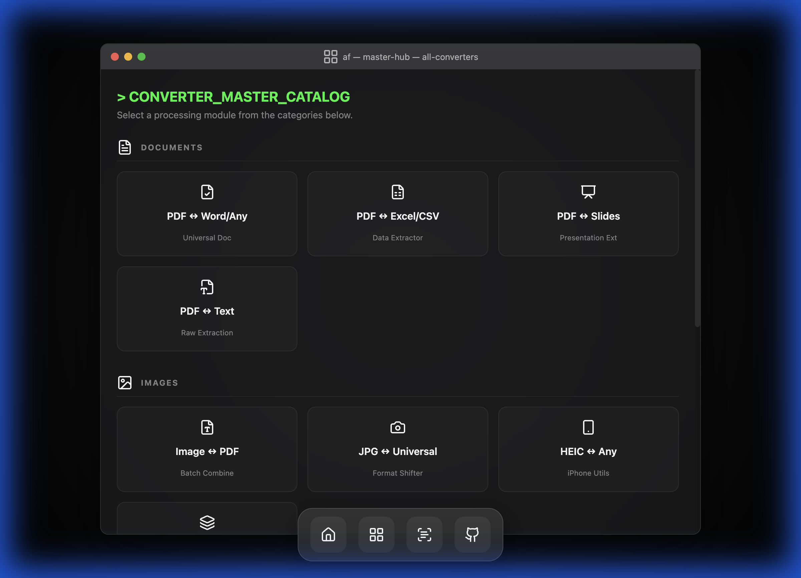
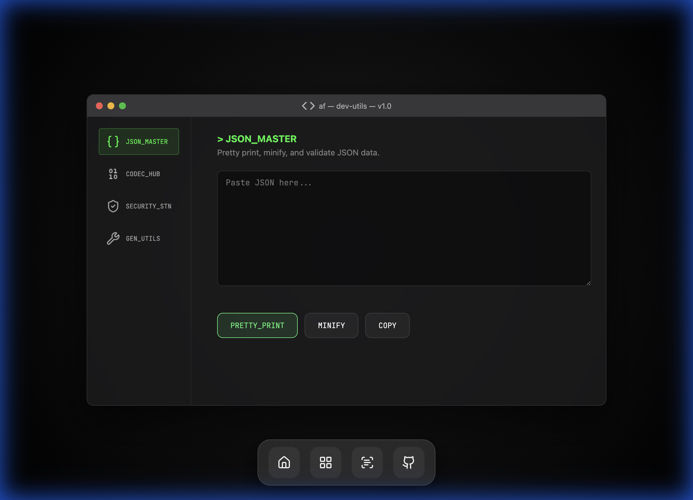

# ⚡ AmazingSuite - The Ultimate Terminal Productivity OS

> **A premium, high-performance toolkit** for OCR, Universal File Conversion, and Developer Utilities. Built with a stunning macOS terminal aesthetic and zero-latency client-side processing.

  

---

## 🖥️ System Preview

| Command Center (v2.4) | Master Hub |
|:---:|:---:|
|  |  |

| Universal Converter (v3.1) | Developer Terminal |
|:---:|:---:|
|  |  |

| OCR Engine (500 DPI) |
|:---:|
|  |

---

## 🚀 Core Modules

### 1. Universal Converter v3.1 (Anything to Anything)
The most powerful client-side converter. No servers. No data tracking. Pure logic.
- **Documents**: Convert PDF to **DOCX (Word)**, TXT, or High-Res Images.
- **Images**: Seamlessly swap between **WebP**, PNG, JPG, BMP, and PDF.
- **Smart Extraction**: Features a hybrid engine that extracts native PDF text layers or performs OCR when needed.
- **Batch Processing**: Multi-page conversions are automatically packaged into high-speed ZIP archives.

### 2. Atomic OCR Engine
Optimized for maximum accuracy and speed with three distinct performance profiles:
- **🏎️ Super Fast**: Low resolution for instant previews.
- **⚖️ Balanced**: Standard quality for clean documents.
- **🎯 500 DPI Ultra**: Maximum precision for small text and handwriting.
- **Output**: Generates searchable PDFs and raw text layers in 50+ languages.

### 3. Developer Utilities Terminal
A dedicated suite for modern developer workflows:
- **JSON Master**: Pretty print, minify, and lint your JSON data instantly.
- **Codec Hub**: Instant Base64 and URL encoding/decoding.
- **Security Station**: Local-first SHA-256/MD5 generation and **JWT decoding**.
- **Gen Utils**: Live Epoch time conversion and UUID v4 generation.

---

## ⌨️ Power Commands
Access AmazingSuite via the main terminal using these zsh-style commands:
- `help` - Show all available modules.
- `/hub` - Launch the Master Converter Hub.
- `/ocr` - Boot the AmazingOCR Neural Engine.
- `/dev` - Open the Developer Utilities Terminal.
- `/clear` - Wipe the terminal buffer.

---

## 🛠️ Technology Stack
- **Frontend**: Vanilla JS (ES6+), CSS Grid/Flexbox
- **Processing**: 
    - `Tesseract.js` (OCR Engine)
    - `pdf-lib` (PDF Creation/Modification)
    - `pdf.js` (PDF Rendering & Extraction)
    - `docx.js` (Word Document Generation)
    - `JSZip` (Batch Packaging)
    - `Crypto-JS` (Hashing & Security)
- **Aesthetics**: Lucide Icons, JetBrains Mono, Frosted Glass (CSS Filters)

---

## ⚙️ Installation & Usage

AmazingSuite is entirely static and requires no server. 

```bash
# Clone the repository
git clone https://github.com/helpmastr/amazingocr.git

# Navigate and open
cd amazingocr
open index.html
```

---

## 🤝 Contributing & Community
We welcome contributions! Whether it's adding new conversion modules or refining the terminal theme:
1. Fork the Project
2. Create your Feature Branch (`git checkout -b feature/AmazingFeature`)
3. Commit your Changes (`git commit -m 'feat: add amazing utility'`)
4. Push to the Branch (`git push origin feature/AmazingFeature`)
5. Open a Pull Request

---

> Created with passion by [helpmastr](https://github.com/helpmastr). If you find this useful, **leave a ⭐ on GitHub!**
